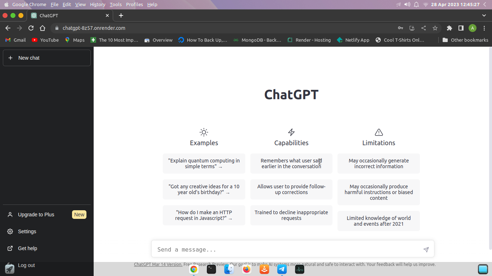

[](https://zenodo.org/doi/10.5281/zenodo.10499353)
[](https://github.com/kaushikjadhav01/ChatGPT-Clone-MERN/blob/main/LICENSE)
[](https://codecov.io)

[](https://github.com/kaushikjadhav01/ChatGPT-Clone-MERN/edit/master/README.md)


[](https://img.shields.io/github/repo-size/kaushikjadhav01/ChatGPT-Clone-MERN.svg)
[](https://github.com/kaushikjadhav01/ChatGPT-Clone-MERN/commits/main)

[](https://github.com/kaushikjadhav01/ChatGPT-Clone-MERN)
[](mpp-backend)


# ChatGPT-Clone-MERN:
ChatGPT clone using MongoDB, Express.JS, React.JS, Node.JS
<!-- TABLE OF CONTENTS -->
<details>
  <summary>Table of Contents</summary>
  <ol>
    <li><a href="#system-description-and-functions">System Description and Functions</a></li>
    <li><a href="#built-with">Built With</a></li>
    <li><a href="#installation">Installation</a></li>
    <li><a href="#authors">Authors</a></li>
    <li><a href="#links">Links</a></li>
  </ol>
</details>

## System Description and Functions
ChatGPT clone using MongoDB, Express.JS, React.JS, Node.JS



## Built With


## Installation
1. Download & Install Git (https://git-scm.com/downloads)
2. Download & Install Node.js (https://nodejs.org/en/download/)
3. Clone repo, cd into ChatGPT/client
4. Run ```npm install```
5. Run ```npm run dev```
6. To launch backend now, open new terminal.
7. cd into ChatGPT/server
8. Run ```npm install```
9. Run ```npm start```

## Authors
### Kaushik Jadhav
<ul>
<li>Github: https://github.com/kaushikjadhav01</li>
<li>Medium: https://medium.com/@kaushikjadhav01</li>
<li>LinkedIn: https://www.linkedin.com/in/kaushikjadhav01/</li>
<li>Portfolio: http://kajadhav.me/</li>
<li>Linked In: https://www.linkedin.com/in/kajadhav/
<li>Dev.to: https://dev.to/kaushikjadhav01
<li>Codesignal: https://app.codesignal.com/profile/kaushik_j_vtc
<li>Google Scholar: https://scholar.google.com/citations?user=iRYcFi0AAAAJ
<li>Daily.dev: https://app.daily.dev/kaushikjadhav01
<li>Google devs: https://developers.google.com/profile/u/kaushikjadhav01
<li>Stack Overflow: https://stackoverflow.com/users/21890981/kaushik-jadhav
</ul>

## Links
* [Issue tracker](https://github.com/kaushikjadhav01/ChatGPT-Clone-MERN/issues)
* [Source code](https://github.com/kaushikjadhav01/ChatGPT-Clone-MERN)
